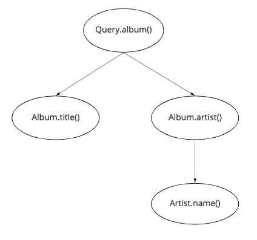
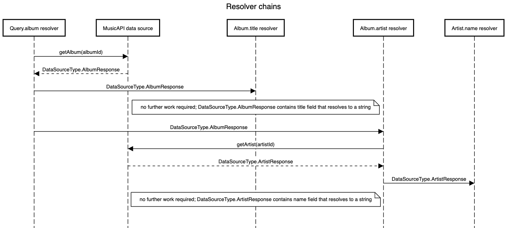

# Part 4: Property Level Resolving
1. Update the schema to return the artist for an album.
    ``` graphql
    type Album {
      title: String!
      artist: Artist!
    }

    type Artist {
      name: String!
    }

    type Query {
      albums: [Album]!
      album(id: ID!): Album
    }
    ```

2. Run the following query and observe the response. Notice how null values are propogated up the graph.
    ``` graphql
    query {
      album(id: "album-1") {
        title
        artist {
          name
        }
      }
    }
    ```

3. Write the Artist resolver using the information received from the parent `Query.album` resolver. 
    - You can declare types in the data source layer and use them in your resolver file. To avoid confusion between the different types, you can import them in your resolver file like below: 
      ``` js
      import * as DataSourceTypes from "./data-source";
      import * as Schema from "./generated/graphql";
      ```

4. Query for  album id `album-1` and then for `album-2` and observe the responses (mock data in Music API has an incorrect id). Notice how nulls get propagated up the schema when a nested field cannot be resolved. 

## Resolver chain
The resolver chain for the query above matches the hierarchical structure of the query itself. Each subchain after the split in `Query.album` is executed in parallel.


The image below is a sequence diagram of the resolver chain (the calls to `Album.title` and `Album.artist` should be in parallel). 
  - **Parent types**: In this example, parent resolvers do not process the data returned from the MusicAPI data source, so the parent type received by child resolvers are DataSourceTypes. In more complex cases however, resolvers may process the response received from data sources before passing them on to child resolvers. In this case, declaring separate resolver types may be helpful.
  - **Property level resolving**: The second call to the MusicAPI data source for an artist will only be invoked if the `Album.artist` resolver is called. Placing this call in the `Album.artist` prevents unnecessary calls to our MusicAPI. [This article](https://medium.com/paypal-tech/graphql-resolvers-best-practices-cd36fdbcef55) provides a good explanation on GraphQL resolvers best practices.
